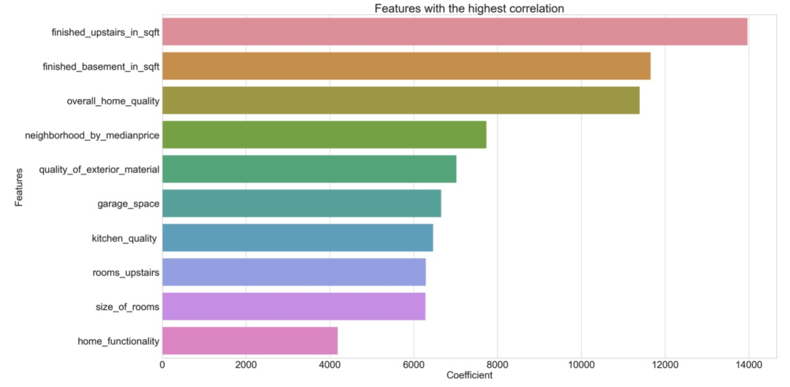
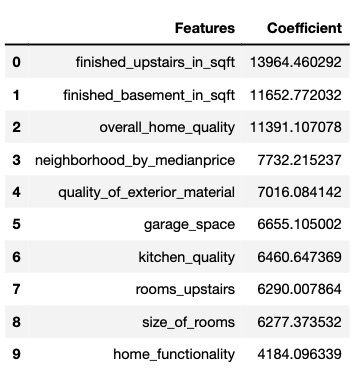

# PROJECT 2
This is the finalized readme file for Project 2. 

# Problem Statement

Property flipping is an investment strategy of purchasing a property with a short holding period with the intent of renovating certain housing features so that we can sell it for a quick profit.
To those about to property flip in Ames, Iowa,  we at ProPrata have an objective - to share our home valuation model that predicts the sale prices of homes in Ames, Iowa. Our optimal model - which carries the lowest root mean square error (RMSE) score - is derived after running and comparing various regression models, namely linear regression, Ridge, Lasso and ElasticNet regression models.
To help the first-time property buyers-cum-flippers in Ames, our model will provide recommendations to help you focus on features that are more likely to increase property value when renovated, and which features to de-prioritise in order to maximise your profits. 
Come have a talk with us over a prata. We can assure you that we flip properties as well as Mr Prata flips his pratas.

# Executive Summary
There are 81 feature columns which are engineered, so we can identify the factors affecting saleprices. The final model uses 31 features, which were selected using a combination of correlation to house sale price, Elastic Net as feature selection. Missing values were filled with a combination of zero values and averages based on the requirement of the feature. Only 13 records were dropped from the original dataset. The chosen model has an R^2 score of around 89%. R^2 is a measure of how well the data fits the model's predicted regression line. The generated coefficients is crucial for our dataset. The selected model was then applied to the test CSV file (after cleaning the test CSV dataset), and the results were submitted to Kaggle (which achieved a final RMSE score of 156795.19056). 

# My Data Dictionary 

All features here are retrieved from Ames Iowa Housing Data Set, which contains assessed values for individual residential properties sold in Ames, Iowa from 2006 to 2010. 

|Feature|Type|Coefficient Value|Description|
|---|---|---|---|
|**Saleprice**|*int64*|NA|Sale price of the house| 
|**Building Age**|*int64*|-2546.7|Age of house at time of sale, Year house sold minus year house built| 
|**Neighbourhood by Median Price**|*int64*|7732.2|Neighboorhood binned by price (1-9), with 1 being the neighbourhood having the lowest range of median sale price| 
|**Positive Features**|*int64*|3287.6|Location Features binned by desirability (1-3), with 1 being the least desirable| 
|**Remodeled Home**|*int64*|2833.6|1 = remodeled, 0 = not remodeled| 
|**Overall Home Quality**|*int64*|11391.1|Overall quality of house material (1-10), with 1 being the lowest quality|  
|**Single Storey Home**|*int64*|-340.4|1 = a single storey house, 0 = not, dummified feature| 
|**Multiple Storey Home**|*int64*|-3630.9|1 =  a two story house, 0 = 1 story house, dummified feature| 
|**Quality of Exterior Material**|*int64*|7016.0|Overall External material quality (1-5), with 1 being the lowest quality| 
|**Type of Exterior Covering House**|*int64*|2020.8|External Feature binned by desirability (1-10), with 1 being the lowest desirable exterior material
|**Middle Unit Townhouse**|*int64*|-2732.5|1 if Townhouse end unit, in reference to single-fam house| 
|**End Unit Townhouse**|*int64*|-1877.8|1 if Townhouse inside unit, in reference to single-fam house| 
|**Family House**|*int64*|-288.3|1 if Two family conversion house, in reference to single-fam house| 
|**Good Roof Quality**|*int64*|2214.3|1 = roof type flat/hip/shed, 0 = mansard/gable/gabrel| 
|**Masonry Veneer Square Feet**|*float64*|3354.6|Masonry veneer area in square feet| 
|**Home Functionality**|*int64*|4184.0|1 if no deduction from damage, else 0| 
|**Lot Frontage**|*float64*|2367.1|Area in square feet of property connected to street| 
|**Outdoor Porch Space**|*int64*|2865.1|combination of deck and patio sqft| 
|**Garage Space**|*float64*|6655.1|Quality of garage finish multiplied by sqft garage| 
|**Size of Car Garage**|*float64*|1792.1|Number of vehicles garage can fit| 
|**Paved Driveway**|*int64*|578.1|1 = Driveway unpaved, 2 = dirt/gravel, 3 = paved| 
|**Basement Quality**|*int64*|2322.6|Overall quality of basement material (0-4), with 0 being the lowest quality| 
|**Lot Size**|*int64*|3712.1|Lot area in square feet| 
|**Finish Basement in Square Feet**|*float64*|11652.7|Basement livability multiplied by bsmt sqft| 
|**Basement Ceiling Height**|*int64*|2170.9|Level of exposure in basement (1-4), with 1 having the lowest exposure| 
|**Heater Quality**|*int64*|1081.9|Heating quality and condition (1-5), with 1 being the lowest quality| 
|**Kitchen Quality**|*int64*|6460.6|Kitchen Quality (1-5), with 1 being the lowest quality|
|**Fireplace Quality**|*int64*|3787.7|Fireplace Quality (if exists) (0-5), with 0 being the lowest quality| 
|**Total Number of Baths**|*float64*|-1509.3|Total number of baths in house (1-7), with 1 being the lowest number of baths| 
|**Finished upstairs in Square Feet**|*int64*|13964.4|Finished sqft of house above ground quality (1-5) multiplied by sqft above ground| 
|**Number of Rooms Upstairs**|*int64*|6290.0|Total rooms above ground (i.e. 2nd floor and above| 
|**Size of Rooms**|*float64*|6277.3|Average size of above ground rooms in sqft, total rooms divided by total sqft| 

# Modeling Process:
Key decisions made during the modeling process:

1. Filled null values with 0: I didn't drop columns with significant null values. When I examined the columns with nulls, I found most of them weren't really reflecting missing information but were input as 'NA' because a house didn't have that feature (ex. pool). I didn't feel it was necessary to treat categorical and numerical columns differently when filling 'null' cells with 0 because I ultimately dummied out the categorical data anyway.

2. Dropping Outliers: According to the data dictionary, it's likely the outliers in our data were from unusual partial sales of large properties. I chose to remove the outliers to make the model better predict the majority of housing prices, and this did improve my model's scores.

3. Mapping Numeric Values to Ordinal Values: Several of the object-type columns were rating the quality of different features of a house (ex. kitchen, fireplace) with string values instead of numeric values. I thought the model would be more powerful if these were numerical values instead of categorical (dummy) variables, so I created dictionaries of numeric values and mapped those to the columns. I went farther than columns with just the 'Poor' to 'Excellent' ratings and mapped numeric values to any feature that seemed to have a clear 'best' to 'worst' value (ex. Basement Finish). I ended up mapping numeric values to 19 features.

4. Feature Selection: for my model, the only features I dropped completely were ID and PID. There were other features that I modified (ex. changed year built to decade and made this categorical) but in general I didn't drop features from the model. I converted categorical variables to dummy variables and scaled them.

# Model Selection
In this dataset, I tested a few linear regression models. Below are some of results of the models evaluated on the final data set. Additional details can be found in the project notebook model evaluation.

|Models Used|R^2(Train)|R^2(Test)|Root Mean Square Error in Dollars|Pipeline Built|Hyperparameter Optimization|Remarks
|---|---|---|---|---|---|---|
|Unscaled Linear Regression|0.9021|0.8943|24,722|No|No||
|Scaled Linear Regression|0.9021|0.8944|24,722|No|No|
|RidgeCV Linear Regression|0.9018|0.8947|24,683|No|Standard Scaler, Alphas using RidgeCV|
|RidgeCV Linear Regression V2|0.8934|0.8946|24,686|Yes|Standard Scaler, Alphas using GridSearch|
|LassoCV Linear Regression|0.9021|0.8946|24,697|No|Standard Scaler, Alphas using LassoCV|
|LassoCV Linear Regression V2|0.8931|0.8945|24,700|Yes|Standard Scaler, Alphas using GridSearch|
|Elastic Net Linear Regression|0.9019|0.8947|24,678|Yes|Standard Scaler, Alphas using GridSearch|Combines Ridge and Lasso|

Amongst the models, the best performing model (although marginally) was the Elastic Net linear regression model as it is the best balance of R^2, coefficient interpretability and RMSE.

# Business Recommendations
<html>
<centre>
Top 10 Features
</centre>	
</html>
<html>
<centre>

</centre>	
</html>
 

<html>
<centre>
Top 10 Features & their Coefficients
</centre>	
</html>
<html>
<centre>

</centre>	
</html>

 After implementing Elastic Net Regression as the final model, we can draw out the top 10 features that our company would advise novice property flippers to modify in order to gain the highest profits.
- To raise the saleprices of their houses, home owners could consider improving the quality of both the basement and quality of 2nd floors and above. This could include adding additional game rooms (e.g. pool tables, in-home cinemas) and making repairs to any faults on these floors.
- Cleaning up and increasing garage space is a great yet simple way to increase the saleprices of the house.
- Having a well equipped kitchen, including in-built ovens, state-of-the-art cooker hobs/induction cookers would make your house sell for a high price. Apparently locals in Ames love to cook!
- Perhaps breaking down walls between rooms to create bigger space is an excellent idea to increase saleprices as well.
- Mostly, location has substantial influence on the saleprice of the house. Specific neighborhoods, like StoneBr, NoRidge and GrnHill are neighborhoods which can command a higher saleprice!

# Reference 
- https://www.bostonfed.org/-/media/Documents/conference/36/conf36g.pdf?la=en
- https://ideas.repec.org/a/tpr/restat/v90y2008i4p599-611.html
- https://fred.stlouisfed.org/series/ASPUS
- https://www.statista.com/statistics/226144/us-existing-home-sales/
- https://www.propertyguru.com.sg/property-guides/property-flipping-singapore-boomer-millennial-28396
- https://en.wikipedia.org/wiki/United_States_housing_bubble
- https://www.investopedia.com/articles/mortgages-real-estate/08/house-flip.asp
- https://www.investopedia.com/terms/f/flipping.asp
- https://www.analyticsvidhya.com/blog/2021/05/yellowbrick-visualization-for-model-predictions/
- https://medium.com/mlearning-ai/a-thorough-dive-into-the-ames-iowa-housing-dataset-part-1-of-5-7205093a5a53
- http://jse.amstat.org/v19n3/decock/DataDocumentation.txt
- https://www.youtube.com/watch?v=VSeGseoJsNA
- https://www.homeyou.com/ia/chimney-repair-ames-costs
- https://newsilver.com/flipping-houses-in/ames-ia/
- https://newsilver.com/the-lender/flipping-houses-in-iowa/
- https://newsilver.com/the-lender/how-to-calculate-arv-simple-guide/

